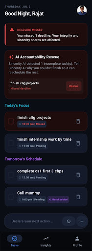
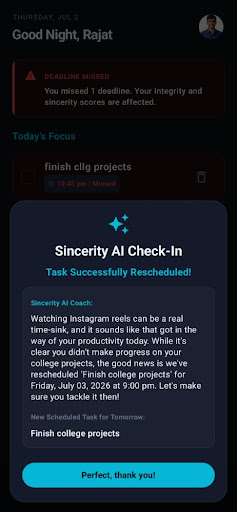
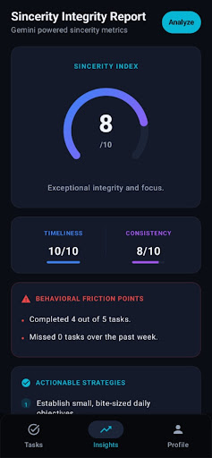
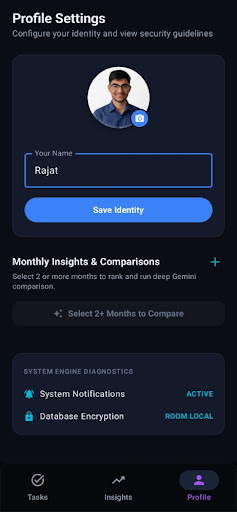
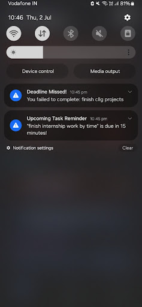

# 🤖 AI Accountability Coach

> *"Productivity isn't about doing more—it's about becoming more consistent."*

A premium Android task manager designed to actively fight procrastination. Unlike traditional to-do lists that silently let you ignore your goals, this app holds you accountable using intelligent reminders, behavioral grading, and built-in **Google Gemini AI** coaching.

📥 **[Download the App (Latest APK)](https://github.com/rajatkarnani2-commits/Sincerity/releases)**

---

## 📸 Screenshots

*(Images are stored in the asset folder and will load automatically)*

 
 
 
 

---

## ✨ Features That Keep You Disciplined

### 🧠 Google Gemini AI Coaching
* **The Missed-Task Interrogation:** You cannot simply clear or ignore a missed deadline. When a task goes overdue, the built-in AI steps in. You must explain honestly why you couldn't finish it on time. The AI reviews your reason, offers feedback, and safely reschedules the task.
* **One-Click Sincerity Analytics:** Instantly generate a daily or lifetime breakdown of your productivity habits. The app grades your timeliness and execution on a scale from 1 to 10.
* **Monthly AI Battle & Rankings:** Select two or more months on your profile screen. The AI will cross-examine your consistency, highlight your positive and negative behavioral trends, and rank those months from best to worst.

### 📋 Smart Task Tracking
* **Guaranteed Deadline Alarms:** Built with deep Android integration so reminders and overdue alerts pop up exactly on the second, even if your phone is asleep.
* **Daily Rollover System:** Any task left unfinished at the end of the day automatically carries over to the next morning, ensuring nothing is swept under the rug.
* **Privacy-First Design:** The app operates 100% offline. Every piece of your schedule, personal journals, and habit analytics stays safely stored on your physical device.

### 👤 Profile Personalization
* **Custom Identity:** Change your display name whenever you want to match your workspace vibe.
* **Fun Profile Avatars:** Upload your personal picture or select from a premium gallery of pre-filled cartoon animal avatars inspired by Google Play Games and Prime Video.

---

## 🛠️ The Tech Stack 

For developers looking under the hood, the app is engineered using Google's modern Android practices:
* **Kotlin & Jetpack Compose:** For a smooth, 100% declarative UI and beautiful dark mode interface.
* **MVVM Architecture:** Keeps UI logic separate from background operations so the app runs without lag.
* **Room Database:** A secure offline database that manages your tasks entirely on your phone's memory.
* **Android AlarmManager:** Handles exact background timers without draining your battery.
* **Google Gemini API:** Connected directly to the 2.5 Flash model to power the context-aware behavior analysis.

---

## 🚀 How to Set Up the Project Locally

**1. Download the Code**
First, you will need to get the project files onto your computer. Scroll to the very top of this GitHub page, click the green **<> Code** button, and select **Download ZIP** to extract the folder. (Alternatively, you can just clone the repository via Git if you prefer).

**2. Open Your IDE**
Launch **Android Studio**, click on **Open**, and select the root directory of the folder you just downloaded.

**3. Add Your Gemini API Token**
Because this app relies on AI, you need a free connection key from Google. 
* Go to Google AI Studio and generate a free API Key. 
* Inside Android Studio, open your `local.properties` configuration file (located in your root folder). 
* Paste this exact text at the very bottom, substituting your real key inside the quotation marks: `GEMINI_API_KEY="your_actual_api_key_here"`

**4. Run the Project**
Let Gradle finish building its files, plug in an Android emulator or physical smartphone, and press the green **Run (Play)** button in your top toolbar!

---

## 🤝 Feedback & Contributions

Got an idea to make the AI coach even stricter, or noticed a bug in the code? Feel free to open a ticket on the **Issues** tab or submit a code revision. All community input is warmly appreciated!
